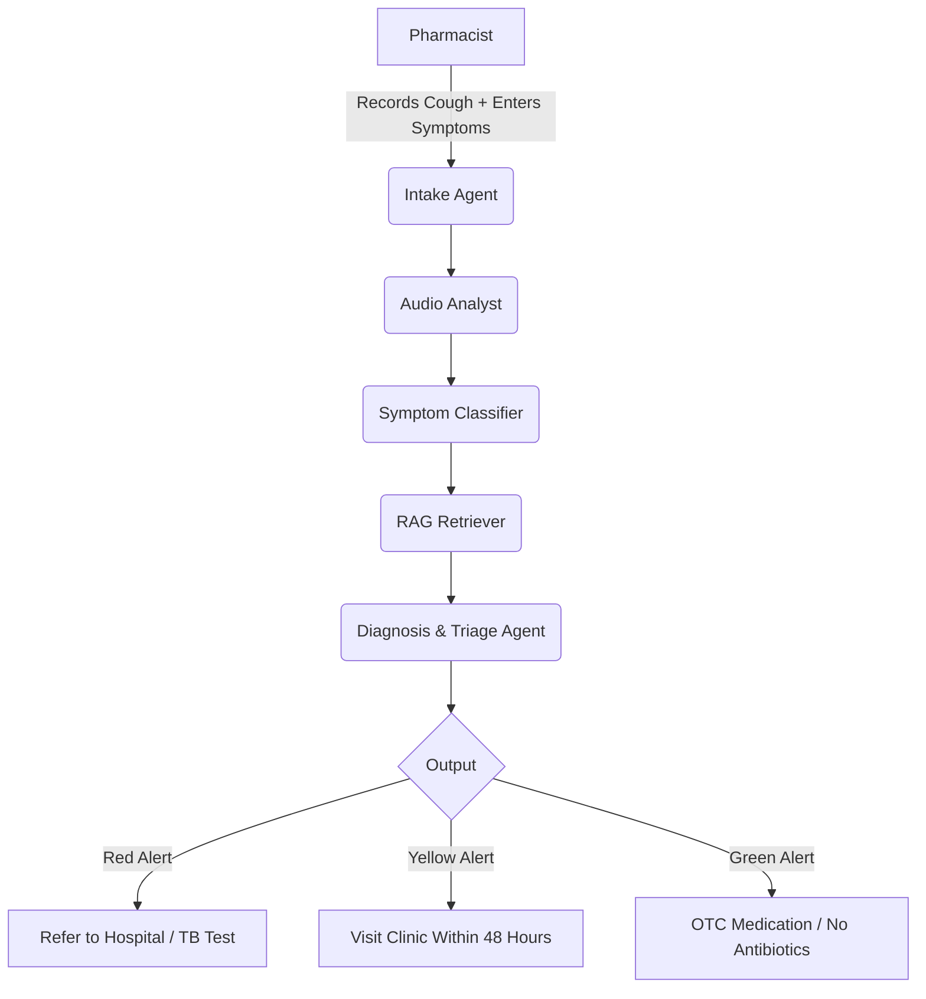

# 🚀 AetherAI - Project Planning & Master Blueprint

**Project Name:** AetherAI  
**Tagline:** *The AI Pharmacist's Stethoscope*  
**Hackathon:** SciBlitz AI Challenge 2026 (CUET)  
**Submission Deadline:** July 8, 2026, 11:59 PM BST  
**Status:** ⚡ Active Development (48-Hour Sprint)

---

# 1. Core Concept & Vision

## What is it?

AetherAI is a **Multi-Agent AI Triage System** designed for rural pharmacists and community health workers in Bangladesh.

It analyzes the sound of a patient's cough via a smartphone microphone to detect five major respiratory conditions and provides **actionable Red / Yellow / Green alerts**.

## Why are we building this?

### The Antimicrobial Resistance (AMR) Crisis

Bangladesh has one of the highest antibiotic consumption rates in South Asia.

Around **80% of coughs are viral**, yet antibiotics are frequently dispensed "just in case," accelerating antimicrobial resistance.

### Silent TB Epidemic

Bangladesh has the **7th highest Tuberculosis burden globally**.

Early TB symptoms are often mistaken for a common cold, delaying treatment and increasing community transmission.

## Who is the user?

### 👨‍⚕️ Primary User

Rural Pharmacists / Community Health Workers

### 🏥 Secondary User

Doctors at Upazila (Sub-district) Health Complexes who receive referrals.

### ❌ Not the Patient

This is **not** a patient-facing application.

Patients generally do not know which disease they have; pharmacists are often their first point of contact.

---

# 2. The Problem We Solve

| Problem | How AetherAI Solves It |
|----------|------------------------|
| **Irrational Antibiotic Dispensing** | AI detects **Viral Cold (Green Alert)** and instructs the pharmacist: **"DO NOT give antibiotics."** |
| **Missed TB Cases** | AI detects **High Suspicion of TB (Red Alert)** and instructs: **"Refer immediately for GeneXpert testing. Wear a mask."** |
| **Lack of Diagnostic Tools** | Turns a smartphone into a low-cost digital stethoscope using AI-powered cough analysis. |

---

# 3. The AI Pipeline (LangGraph Multi-Agent System)

We orchestrate **five specialized AI agents** using **LangGraph** to simulate a doctor's clinical reasoning process.



## Agent Responsibilities

| Agent | Component | Technology | Input | Output |
|--------|-----------|------------|-------|--------|
| **1. Intake Agent** | Conversational History | LangGraph State Management | Pharmacist responses (Age, Fever, Weight Loss, etc.) | Structured Patient Context |
| **2. Audio Analyst** | Deep Learning (CNN) | PyTorch + ResNet50 + Librosa | 5-second cough recording (.wav) | Mel-Spectrogram + Disease Probabilities |
| **3. Symptom Classifier** | NLP + Named Entity Recognition | Whisper (STT) + BanglaBERT | Transcribed Bangla conversation | Structured Symptom Entities |
| **4. RAG Retriever** | Retrieval-Augmented Generation | FAISS + LangChain | Patient Context + Disease Hypothesis | WHO / Bangladesh Guidelines |
| **5. Diagnosis & Triage Agent** | Fusion + LLM | Gemini Flash / GPT-4o-mini | Outputs from previous agents | Red / Yellow / Green Alert + Clinical Recommendation |

---

# 4. Disease Classes & Feasibility

## Disease Classes

The model predicts one of the following respiratory conditions:

- Normal
- Pneumonia
- Tuberculosis (TB)
- Asthma
- COPD

## Is this scientifically feasible?

Yes.

Published research has demonstrated:

- Pneumonia detection using cough audio achieves approximately **94% sensitivity**.
- Tuberculosis detection using cough audio achieves approximately **93% sensitivity**, meeting WHO triage standards.
- Multi-class respiratory disease classification on the **ICBHI 2017 Benchmark** reports approximately **85% accuracy**.

### Key Insight

Different respiratory diseases produce distinct acoustic biomarkers such as:

- Crackles
- Wheezes
- Rhonchi

These patterns become visually distinguishable in **Mel-Spectrograms**, allowing CNN architectures such as ResNet50 to learn disease-specific representations.

---

# 5. Technical Stack

| Category | Technology | Justification |
|----------|------------|---------------|
| Orchestration | LangGraph | Stateful multi-agent workflow orchestration |
| ML / DL | PyTorch, Torchvision | ResNet50 / EfficientNet for spectrogram classification |
| Audio Processing | Librosa, SoundFile | Convert WAV files into Mel-Spectrograms |
| NLP / Transcription | Whisper (Bangla), BanglaBERT | Speech transcription and symptom extraction |
| RAG / Vector Database | FAISS, LangChain | Retrieve WHO and Bangladesh clinical guidelines |
| LLM | Gemini 1.5 Flash (Free Tier) | Clinical reasoning and recommendation generation |
| Backend API | FastAPI + Uvicorn | High-performance REST API |
| Frontend | Gradio | Rapid dashboard development with microphone support |
| Database | SQLite + SQLAlchemy | Store patient histories and diagnoses |
| Deployment | Hugging Face Spaces / Render | Free cloud hosting |
| Monitoring | UptimeRobot | Prevent free-tier deployment from sleeping |
| CI/CD | GitHub Actions | Automated testing and deployment |
| Containers | Docker + Docker Compose | Standardized development environment |

---

# 6. Folder Structure (Definitive Version)

```text
aetherai/
├── .github/
│   └── workflows/
│       └── deploy.yml              # CI/CD pipeline
│
├── backend/
│   ├── api/
│   │   ├── routes/
│   │   │   ├── predict.py          # POST /api/v1/predict
│   │   │   └── history.py          # GET /api/v1/history/{patient_id}
│   │   └── dependencies.py         # DB session, auth mocks
│   │
│   ├── core/                       # ⭐ LangGraph Multi-Agent System
│   │   ├── agents/
│   │   │   ├── intake_agent.py         # Agent 1: Collect patient history
│   │   │   ├── audio_analyst.py        # Agent 2: ResNet50 cough classifier
│   │   │   ├── symptom_classifier.py  # Agent 3: Whisper + BanglaBERT
│   │   │   ├── rag_retriever.py        # Agent 4: FAISS retrieval
│   │   │   └── diagnosis_agent.py      # Agent 5: LLM + triage
│   │   │
│   │   ├── graph/
│   │   │   ├── state.py            # PatientState TypedDict
│   │   │   └── workflow.py         # Compiled LangGraph workflow
│   │   │
│   │   └── models/
│   │       ├── audio_model.pth
│   │       └── nlp_model/
│   │
│   ├── database/
│   │   ├── models.py               # SQLAlchemy ORM models
│   │   └── session.py              # SQLite engine
│   │
│   ├── services/
│   │   ├── pdf_generator.py        # Clinical referral PDF
│   │   └── triage_service.py       # Disease → Alert mapping
│   │
│   ├── rag/
│   │   ├── vector_store/
│   │   └── documents/
│   │
│   └── main.py                     # FastAPI entry point
│
├── frontend/
│   ├── app.py                      # Pharmacist Dashboard
│   ├── doctor_dashboard.py         # Doctor Dashboard
│   │
│   ├── static/
│   │   ├── css/
│   │   │   └── theme.css
│   │   └── assets/
│   │       └── logo.png
│   │
│   └── components/
│       ├── audio_recorder.py
│       └── chat_ui.py
│
├── tests/
│   ├── test_agents.py
│   └── test_api.py
│
├── docker/
│   ├── Dockerfile.backend
│   └── Dockerfile.frontend
│
├── docker-compose.yml
├── requirements.txt
├── .env.example
└── README.md
```

---

# 7. Development Phases & Team Assignment

With approximately **24 hours remaining**, development should be parallelized.

| Phase | Tasks | Owner | Estimated Time |
|--------|-------|-------|----------------|
| **Phase 1** | Build LangGraph workflow, create dummy agents, download ResNet50 weights, implement spectrogram preprocessing | Teammate A | 4 hours |
| **Phase 2** | Build FastAPI backend, SQLite integration, `/predict` endpoint, triage logic | Teammate B | 3 hours |
| **Phase 3** | Build Gradio dashboards for pharmacists and doctors, apply branding | Teammate C | 3 hours |
| **Phase 4** | Load WHO and Bangladesh NTP guidelines into FAISS and connect the RAG agent | Teammate B | 2 hours |
| **Phase 5** | End-to-end integration testing, generate referral PDFs | Entire Team | 2 hours |
| **Phase 6** | Deploy application, configure monitoring, record demonstration video | Teammate A | 2 hours |

---

# 8. Running the Project

## Local Development

```bash
# Clone repository
git clone https://github.com/yourteam/aetherai.git

cd aetherai

# Start services
docker-compose up --build
```

### Application URLs

**Frontend (Gradio)**

```
http://localhost:7860
```

**Backend API (FastAPI Swagger)**

```
http://localhost:8000/docs
```

---

## Deployment

Recommended deployment platforms:

- Hugging Face Spaces
- Render

Example deployment URL:

```
https://aetherai.hf.space
```

Use **UptimeRobot** to ping the application every 30 minutes to prevent free-tier sleep.

---

# 9. Data Sources

The project relies on publicly available medical datasets and official clinical guidelines.

| Resource | Source | Purpose |
|----------|--------|---------|
| **ICBHI 2017 Respiratory Sound Database** | Kaggle / PhysioNet | Respiratory audio dataset for training and evaluation of cough/lung sound models |
| **WHO Pneumonia Guidelines** | World Health Organization | Clinical recommendations used in the RAG pipeline |
| **WHO Tuberculosis Guidelines** | World Health Organization | TB diagnosis and referral guidelines |
| **Bangladesh National TB Control Programme (NTP)** | Directorate General of Health Services (DGHS), Bangladesh | Country-specific TB diagnosis and referral workflow |
| **Bangla Speech Dataset** | OpenSLR / Hugging Face | Fine-tuning Whisper for Bangla speech recognition |

---

# 10. The "Killer" Presentation Narrative

## Opening

> Bangladesh has one of the highest antibiotic consumption rates in South Asia, while also carrying one of the world's highest Tuberculosis burdens.
>
> Nearly 70% of rural patients visit a pharmacist before seeing a doctor.
>
> That pharmacist often has no stethoscope, no laboratory, and no X-ray machine.

---

## The Problem

When a patient arrives with a cough, pharmacists frequently prescribe antibiotics "just in case."

Most of these coughs are viral.

The result is:

- Rising antimicrobial resistance (AMR)
- Delayed TB diagnosis
- Increased community transmission
- Unnecessary healthcare costs

---

## Our Solution

**AetherAI transforms a smartphone into an AI-powered digital stethoscope.**

Using a **five-agent LangGraph system**, AetherAI:

1. Records the patient's cough.
2. Collects structured symptoms.
3. Analyzes cough acoustics.
4. Retrieves evidence from WHO and Bangladesh clinical guidelines.
5. Produces an actionable triage recommendation.

The pharmacist receives one of three clear decisions:

### 🟢 Green Alert

- Viral/common respiratory illness likely
- Recommend OTC medication
- **Do NOT prescribe antibiotics**

---

### 🟡 Yellow Alert

- Medical review recommended
- Refer patient to a clinic within 24–48 hours

---

### 🔴 Red Alert

- High suspicion of Tuberculosis or severe pneumonia
- Wear a mask
- Isolate where appropriate
- Refer immediately for GeneXpert testing or hospital evaluation

---

## Our Mission

We are **not replacing doctors.**

We are giving frontline healthcare workers an intelligent screening assistant that helps them:

- Reduce unnecessary antibiotic use
- Detect Tuberculosis earlier
- Improve rural healthcare accessibility
- Support evidence-based decision making

Ultimately, AetherAI aims to become an AI shield against the next antimicrobial resistance crisis.

---

# GitHub Repository

> **To be added**

---

# Live Demo

> **To be added**

---

# Team Information

**Team Lead**

> *To be added*

**Team Members**

- Teammate 1
- Teammate 2
- Teammate 3

---

# Project Status

- ✅ Planning Complete
- ✅ Architecture Designed
- 🚧 Development In Progress
- 🚀 Preparing for SciBlitz AI Challenge 2026 Submission


