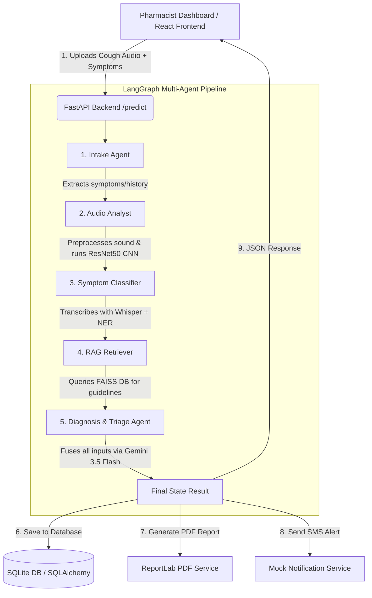

# 🩺 AetherAI - Project Summary & Tech Flow

**AetherAI** (*The AI Pharmacist's Stethoscope*) is a **Multi-Agent AI Respiratory Triage System** designed specifically for rural pharmacists and community health workers in Bangladesh. By analyzing a patient's symptoms and cough audio recording via a web interface, it screens for major respiratory conditions (Normal, Pneumonia, Tuberculosis, Asthma, and COPD) and provides color-coded, actionable clinical recommendations (**Red / Yellow / Green Alerts**).

The primary objective is to combat:
1. **The Antimicrobial Resistance (AMR) Crisis**: Preventing unnecessary antibiotic prescriptions for viral colds (Green Alert).
2. **The Silent TB Epidemic**: Detecting high-risk Tuberculosis symptoms early (Red Alert) and directing users to immediately refer patients for GeneXpert testing.

---

## 🛠️ The Tech Flow & Architecture

AetherAI employs a stateful multi-agent system orchestrated via **LangGraph**, communicating with a **FastAPI** backend and a modern **React (Vite + TypeScript + Tailwind CSS)** frontend.



### 1. The Multi-Agent Pipeline (LangGraph)
The clinical reasoning process is divided into 5 specialized agents that share a common state (`PatientState`):
*   **Intake Agent**: Parses input notes and basic patient history (age, gender, region, fever, weight loss).
*   **Audio Analyst**: Takes the uploaded audio (`.wav`/`.mp3`/`.m4a`), extracts a Mel-Spectrogram using **Librosa**, and passes it through a custom-head **ResNet50 (PyTorch)** deep learning model to predict probabilities for the 5 respiratory classes.
*   **Symptom Classifier**: Uses **OpenAI Whisper (Tiny)** to transcribe speech and runs a lightweight Named Entity Recognition model (**dslim/bert-base-NER**) to extract clinical symptom words.
*   **RAG Retriever**: Creates an embedding of the patient's symptoms and predicted disease using the Gemini Embedding model, then queries a local **FAISS Vector Database** containing official WHO and Bangladesh National Tuberculosis Programme (NTP) guidelines to retrieve relevant treatment protocols.
*   **Diagnosis & Triage Agent**: Fuses the outputs from all previous agents (acoustic probabilities, symptoms, transcripts, and clinical guidelines) and prompts **Gemini 3.5 Flash** (via `google-genai` SDK) to output a structured JSON containing the final diagnosis, confidence score, triage level, and action plan.

### 2. Safety Net & Fallbacks
If the external LLM API (Gemini) fails or runs out of credits, a **Deterministic Fallback Triage Service** intercepts. It uses hardcoded rules based on acoustic classifier confidence combined with key symptoms (e.g., *cough duration > 14 days + fever + high acoustic crackle probability* $\rightarrow$ **RED ALERT**).

### 3. Reporting & Notifications
*   **PDF Generator**: A backend service using **ReportLab** dynamically creates a professional, color-coded medical PDF report detailing the diagnosis, triage level, and guideline citations.
*   **Notification Service**: A mock SMS/WhatsApp service simulating sending alert messages to the patient's or clinic's phone number.

---

## 📂 Folder Structure Walkthrough

Here is what is happening inside the key directories of this project:

```text
AetherAI_1/
├── backend/                        # 🐍 Python FastAPI Backend
│   ├── api/                        # API Routing & Controllers
│   │   ├── routes/
│   │   │   ├── predict.py          # Endpoint: POST /api/v1/predict (entry point for the pipeline)
│   │   │   └── history.py          # Endpoint: GET /api/v1/history/{patient_id}
│   │   └── dependencies.py         # Database session dependency injection
│   │
│   ├── core/                       # 🧠 Core AI Logic
│   │   ├── agents/                 # Individual LangGraph Agents
│   │   │   ├── intake_agent/       # Agent 1: Extracts history from input
│   │   │   ├── audio_analyst/      # Agent 2: Audio preprocessing & ResNet50 model
│   │   │   ├── symptom_classifier/ # Agent 3: Whisper speech-to-text & NER
│   │   │   ├── rag_retriever/      # Agent 4: FAISS vector database lookup
│   │   │   └── diagnosis_agent/    # Agent 5: Gemini LLM clinical triage fusion
│   │   │
│   │   ├── graph/                  # LangGraph Workflow Orchestration
│   │   │   ├── state.py            # PatientState schema definitions (shared memory)
│   │   │   └── workflow.py         # Connects nodes and compiles the state graph
│   │   │
│   │   └── models/                 # Local directory for cached ML weights
│   │
│   ├── database/                   # 💾 Local SQLite Database
│   │   ├── models.py               # SQLAlchemy ORM schemas for Patients and Diagnoses
│   │   └── session.py              # SQLite configuration
│   │
│   ├── rag/                        # 📚 Vector DB and Documents
│   │   ├── documents/              # WHO / Bangladesh NTP Guidelines (PDFs)
│   │   └── vector_store/           # FAISS index and metadata
│   │
│   ├── services/                   # 🛠️ Utility Services
│   │   ├── notification/           # SMS/WhatsApp alert dispatching (mocked)
│   │   ├── reporting/              # ReportLab PDF report generation
│   │   └── triage/                 # Deterministic fallback triage logic
│   │
│   └── main.py                     # FastAPI entry point & app configuration
│
├── frontend/                       # ⚛️ React Dashboard Frontend
│   └── web/                        # React + Vite setup
│       ├── public/                 # Static assets (icons, images)
│       └── src/
│           ├── components/         # Reusable React components (Audio recorder, Layout elements)
│           ├── pages/              # Primary pages: PatientIntake (form + audio) & TriageResults
│           ├── lib/                # Utilities and Tailwind integrations
│           ├── App.tsx             # Main routing component
│           └── main.tsx            # React application mount
│
├── weights/                        # 📦 Hugging Face / PyTorch downloads cache
├── docker/                         # 🐳 Containers for backend and frontend
├── docker-compose.yml              # Standardized orchestrator for local development
├── download_weights.py             # Pre-fetches models (ResNet50, Whisper, BERT) to save time
├── requirements.txt                # Python package list
├── planning.md                     # Hackathon blueprint & pitch narrative
└── README.md                       # Project quickstart
```

---

## 🔁 Complete Data Lifecycle

1.  **Submission**: The pharmacist enters patient demographics, inputs checkboxed symptoms, and records/uploads a 5-second cough audio snippet.
2.  **Audio Processing**: The sound is converted into a Mel-spectrogram image tensor. The fine-tuned ResNet50 predicts probabilities like `{"crackles": 0.82, "wheezes": 0.12, "normal": 0.06}`.
3.  **Entity Parsing**: Any voice annotations or notes are processed using transcription and NLP pipelines to identify clinical terms (e.g., "fever", "weight loss").
4.  **Retrieval**: The system searches FAISS for clinical guidelines matches (e.g., finding that *fever + cough > 14 days* suggests TB screening under Bangladesh NTP guidelines).
5.  **LLM Reasoning**: Gemini synthesizes the findings and returns an alert level:
    *   🟢 **Green Alert**: Viral cold, rest, paracetamol. *Do NOT give antibiotics.*
    *   🟡 **Yellow Alert**: Moderate risk. Refer to a clinic in 24–48 hours.
    *   🔴 **Red Alert**: High-risk TB or severe Pneumonia. Refer immediately for GeneXpert test.
6.  **Persistence & Reporting**: The results are saved to `aetherai.db`, a PDF report is generated under `/reports`, a mock SMS is printed to console, and the React frontend displays the triage results dashboard with a button to download the PDF.
